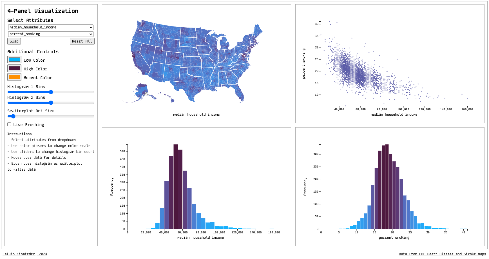

# 4-Panel Visualization

## Data

The data used in this project is from the [Interactive Atlas of Heart Disease and Stroke](https://www.cdc.gov/dhdsp/maps/atlas/index.htm), maintained by the Centers for Disease Control and Prevention. This data is collected into a single CSV file organized by county and state, and includes information on heart disease and stroke mortality rates, as well as demographic information including
- economics (poverty percentage, median household income, percent of the population that complete high school)
the environment (air quality, park access)
- behavioral factors of the population in the county (percent of the county that is inactive, percent smoking)
- demographics (percent elderly, whether the county is rural, urban, suburban or a small city)
- health care (number of hospitals, number of primary care physicians, percent of the population with no health insurance,)
- health (percent high blood pressure, percent coronary heart disease, percent stroke, percent high cholesterol). 

## Visualization Components

### Views

There are four views in the visualization. The first view is a chloropleth map of the United States, where the color of each county is determined by the value of the first variable selected by the user. The second view is a scatter plot of the two variables selected by the user, where the x-axis is the first variable and the y-axis is the second. The third view is a histogram of the first variable, and the fourth view is a histogram of the second variable. The closer the color of a point is to the low end of the color scale, the lower the value of the accent variable, and the closer the color of a point is to the high end of the color scale, the higher the value of the accent variable. 

### Controls

There are two dropdown menus that allow the user to select from the data which two variables they would like to compare. There is a button to swap the two variables, and a button to reset the visualization to the default view. There are three color pickers, one for the low end of the color scale, one for the high end, and one for the accent (highlight) color. There are three sliders, two that allow the user to select the number of bins for each histogram, and one to control the size of the points in the scatter plot. Lastly, there is a checkbox to toggle real-time updates for the brush tool.

The user can select a range of points in the scatter plot, and the chloropleth map will update to show only the counties that correspond to the selected points. The user can also select a range of values in the histograms, and the scatter plot and chloropleth will update to show only the points that correspond to the selected range. Brushing over the scatterplot results in an *intersection* of the selected points, while brushing over the histograms results in a *union* of the selected points.

## Process

I designed this application using [d3.js](https://d3js.org/). I use both a object-oriented and functional approach to the code -- I wouldn't combine paradigms in this way in the future, but I was learning as I went along. There is a main file `js/main.js` that is the entry point for the application. This file contains the main function that initializes the visualization, and the event listeners for the controls. The `js/` directory also contains a file for each view type. The `css/` directory contains the styles for the application, and the `data/` directory contains the data file. I structured the code to use both global and class varaiables depending on what needed to be shared between views, and what was specific to a single view instance. The code is available [here](https://github.com/ckinateder/health-data-viz) and deployed [here](https://ckinateder.github.io/health-data-viz/).

## Discoveries

There are lots of conclusions that can be made from this application. One interesting correlation I noticed was that counties with lower income had higher rates of heart disease and stroke. 

## Future Improvements

- Brushing over chloropleth map to select counties
- Clicking + brushing to select multiple ranges
- Responsive design
- Better code organization

## Link to Demo Video

Include a 2-3 minute demo video, showing your application in action.  The easiest way to record this is with a screen capture tool, which also captures audio- such as Quicktime.  Use a voiceover or video captions to explain your application.  Demo videos should be sufficient on their own, but can reference your documentation.  Include the name of the project, your name, the project components, and how your application works.  You can present it on your webpage or on youtube, but linked on your webpage. 